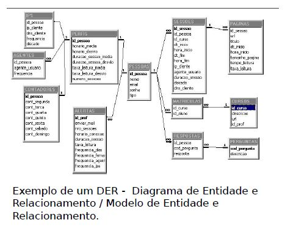
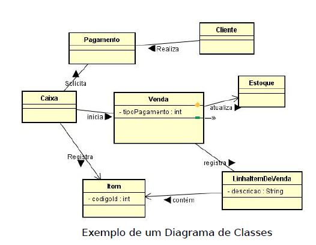

# Bancos de Dados SQL e NoSQL do Básico ao Avançado da Geek University

## Seção 1 - Apresentação

Nesta seção foi feita uma breve apresentação do curso demonstrando todos os módulos e seus assuntos.

## Seção 2 - Introdução ao Banco de Dados

### Aula 4 - Dado e Informação

**Dado:** Elemento bruto geralmente proveniente de uma entrada do usuário ou de outros sistemas.

**Informação:** Elemento processado (_lapidado_) constituído de dados.

### Aula 5 - Banco de dados relacional x não relacional

Os bancos de dados são conhecidos como **SQL** enquanto que os bancos de dados não relacionais são conhecidos como **NoSQL**.

**SQL:** Structured Query Language ou **linguagem de consulta estruturada**.
**NoSQL:** Not only Structured Query Language ou, **não somente linguagem de consulta estruturada**.

Ou seja, no caso do NoSQL, não quer dizer que os bancos de dados não usem SQL, mas que podem ou não usar SQL, mas sempre usam algo mais, mas geralmente utilizam comandos diferenciados.

**Banco de Dados Relacional**

**Pontos Fortes:** Os SGBDRs - Sistemas Gerenciadores de Bancos de Dados, conforme são chamados, oferecem ao usuários processos de validação, verificação e garangias de integridade dos dados.

Além disso, oferencem controle de concorrência, recuperação de falhas e segurança, controle de transações, otimização de consultas, dentre outros.

**Pontos Fracos:** Dificuldade em conciliar o modelo relacional com a demanda por escalabilidade cada vez mais frequente.

Dificuldade em se organizar os dados em um sistema distribuído trabalhando com particionamento de dados.

**Banco de Dados Não Relacional**

O termo NoSQL surgiu em 1998, a partir de uma solução de banco de dados que não oferecia uma interface SQL, mas ainda assim estava baseado inicialmente na arquitetura relacional.

Posteriormnente, o termo passou a representar soluções que promoviam uma alternativa ao Modelo Relacional, tornando-se uma abreviação de _Not Only SQL_ - Não apenas SQL.

O grande diferencial aqui é a performance, pois por não utilizar um modelo estruturado em tabelas, consegue-se trabalhar com os dados de forma muito mais rápida.

**Características em Comum:** Como são livres do modelo relacional, promovem alta disponibilidade e maior escalabilidade.

**Algumas implementações oferecem:**

- O particionamento e a replicação de dados;
- Sistemas baseados em armazenamento de chave/valor;
- Sistemas orientados a documentos;
- Sistemas orientados a coluna;
- Sistemas baseados em grafos;
- etc.

### Aula 6 - Principais bancos de dados relacionais

- Oracle Database;
- Microsoft SQL Server;
- PostgreSQL;
- Teradata;
- MariaDB;
- MySQL;
- IBM DB2;
- Sybase;
- H2;
- Microsoft Access;
- Apache Derby;
- Hive;
- HyperSQL;
- SQLite.

### Aula 7 - Principais bancos de dados não relacionais

- HBASE;
- CouchDB;
- Redis;
- Cassandra;
- Neo4j;
- MongoDB;
- RAVENDB;
- membase;
- riak;
- elasticsearch;
- Oracle Coherence;
- Apache Solr;
- Firebase.

### Aula 8 - Arquitetura cliente/servidor

Basicamente esta aula é uma recapitulação rápida da arquitetura cliente servidor demonstrando quem e o que é o cliente, quem é e o que é o servidor e por fim, o que temos entre essas duas pontas.

## Seção 3 - Modelagem de dados

### Aula 11 - Modelagem conceitual, lógica e física

Os modelos dos bancos de dados são utilizados para descrever mais detalhadamente a estrutura de um banco de dados. Portanto, os modelos servem como parte importante da documentação dos sistemas que auxiliam os desenvolvedores que trbalham no projeto, criação e implantação do sistema como também servem como documentação final para o cliente que contratou o serviço.

**Modelagem Conceitual:** Este é o modelo de mais alto nível, ou seja, mais próximo dos usuários.

O nível conceitual é desenvolvido com alto nível de abstração, a partir dos requisitos do sistema extraídos na fase de levantamento de requisitos feita pelos analistas de sistemas.

Esse modelo pode ser desenvolvido de forma textual ou por meio de dois tipos de diagramas:

- **Diagrama de entidade e relacionamento**;
- **Diagrama de classes**.

### Modelo conceitual Textual:

Imagine duas tabelas (Entidades) como bancos de dados separados:

- **1 - Clientes**
    - <u>Dados necessários</u>: nome completo, tipo de pessoa (física ou jurídica), endereço, bairro, cidade, estado, telefone, email, nome do contato.

- **2 - Pedido**
    - <u>Dados necessários</u>: código do produto, quantidade, código do cliente, código do vendedor

**OBSERVAÇÃO:** Este formato não é o mais interessante para ser usado

### Modelo conceitual Entidade Relacionamento:

### Modelo conceitual Diagrama de Classes:

**OBSERVAÇÃO:** No caso do Diagrama de classes, implica que o sistema será desenvolvido usando Orientação a Objetos, mas nem todo sistema utiliza orientação a objetos para ser desenvolvido.

**Modelagem Lógica:**

Este modelo descreve como os dados serão armazenados no banco de dados e também seus relacionamentos.

Neste modelo ainda pode ser definida a tecnologia que será utilizada para armazenagem dos dados: Bancos de Dados Relacionais ou Não Relacionais.

**Modelagem Física:**
